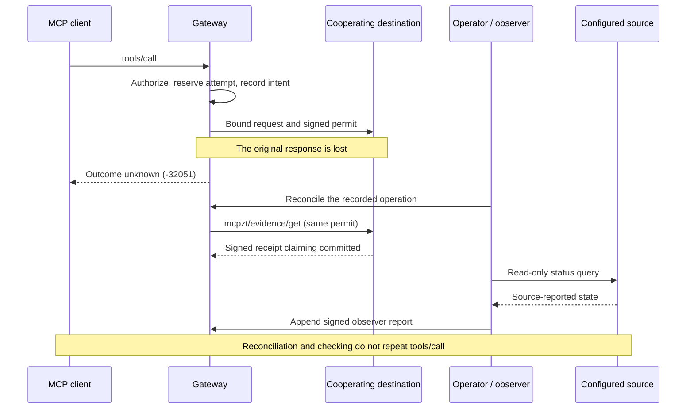

# MCPZT documentation — 0.6.0

Start with the guide for the task you need to perform. The product source, examples and these guides live on `main`; the `landing` branch builds the website. Release tags identify frozen versions of the product.

| I want to… | Start here |
| --- | --- |
| Install MCPZT and try a gateway | [Project quick start](../README.md#installation) |
| Choose an executable example | [Example catalog and prerequisites](../examples/README.md) |
| Connect a client | [Client compatibility](CLIENT_COMPATIBILITY.md) |
| Understand supported transports and limits | [Supported profile](SUPPORTED_PROFILE.md) |
| Operate a gateway | [Production guide](PRODUCTION.md) |
| Understand what each validator can enforce | [Validator limits](VALIDATOR_LIMITS.md) |
| Integrate signed destination receipts | [Destination evidence contract](EVIDENCE.md) |
| Compare a receipt with an external source | [External checks and observer trust](EXTERNAL_CHECKS.md) |
| Upgrade, recover a timeout or interpret a check | [0.6.0 evidence operations](EVIDENCE_OPERATIONS.md) |
| Inspect public synthetic evidence | [Frozen comparison fixtures](../examples/evidence/external-checks/README.md) |
| Prepare an existing Stripe sandbox operation | [Sandbox deployment template](../examples/evidence/stripe-sandbox/README.md) |
| Assess validation and remaining limitations | [0.6.0 validation record](TESTING_0.6.0.md) |
| Build and publish a release | [Release guide](PYPI_RELEASE.md) |

## Follow one call

This is the timeout path for an evidence-enabled, cooperating destination. The source query is a separate operator action, not a browser action or an automatic retry. The bundled external-check demo simulates the source.

## Keep the three conclusions separate

- **Authorization:** the gateway permitted a particular request. A signed permit alone does not establish dispatch.
- **Receipt:** the destination signed a claim bound to that authorization, request and attempt. The signature does not establish that the claim is true.
- **External report:** an observer queried a configured source and signed what it found. Offline verification authenticates the observer; it does not establish a provider signature, administrative independence or current external state.

Evidence is off by default. The basic policy examples, local ledger demo and external-check demo exercise different profiles; their prerequisites are listed in the [example catalog](../examples/README.md).
